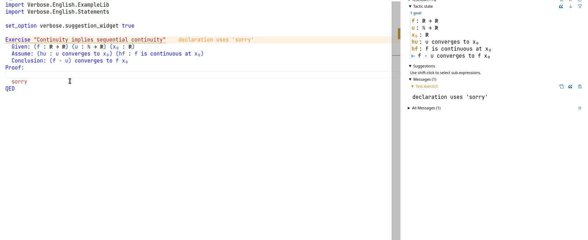

# Verbose Lean 4

This project provides tactics and commands for
[Lean](https://leanprover-community.github.io/) in a very controlled
natural language. The original version of those tactics were written in
French for teaching purposes at 
[Université Paris-Saclay](https://www.universite-paris-saclay.fr/) in
Orsay using Lean 3. The goal is not to make Lean code easier to write, the goal is to
make Lean code easier to transfer to a traditional paper proof.

The best way to have a quick look is to read the examples file
in [English](https://github.com/PatrickMassot/verbose-lean4/blob/master/Verbose/English/Examples.lean) or 
[French](https://github.com/PatrickMassot/verbose-lean4/blob/master/Verbose/French/Examples.lean),
although GitHub obviously misses proper syntax highlighting here.

There is also an experimental point-and-click interface for courses with a low time budget. One can see it in the following animated gif.

This Lean 4 version is not yet well tested since it has not been used for teaching yet. Error messages are not yet translated. 
If you use those tactics for teaching, I'd be very interested to hear about it, and would gladly add your name and the name of your university in this file.
